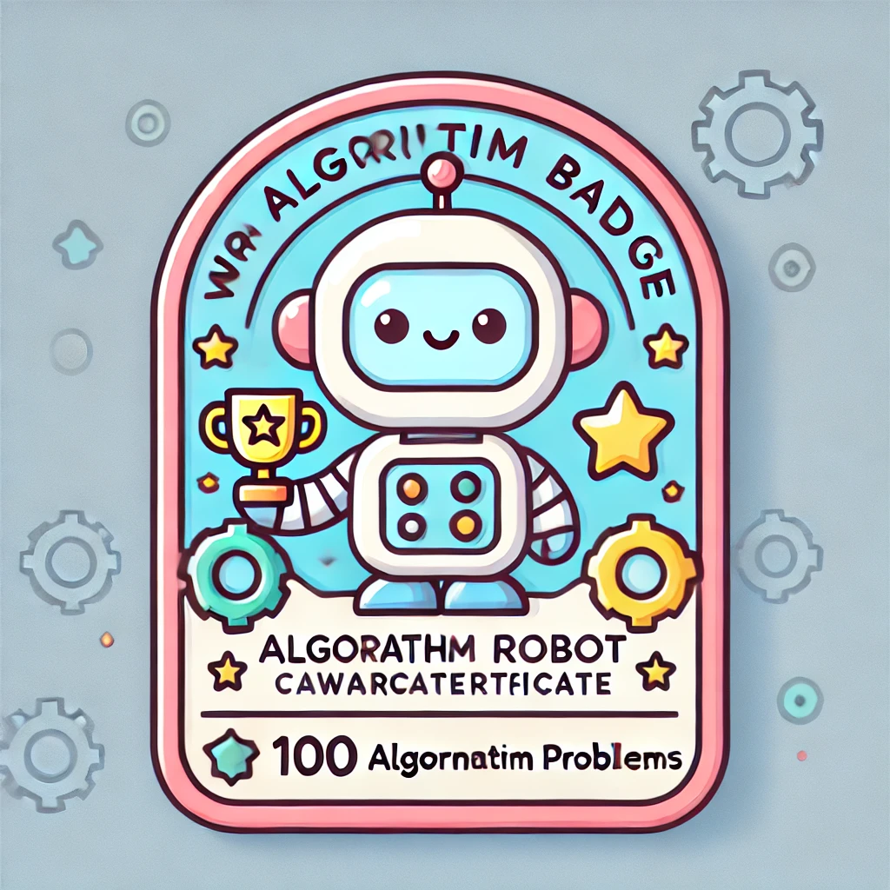
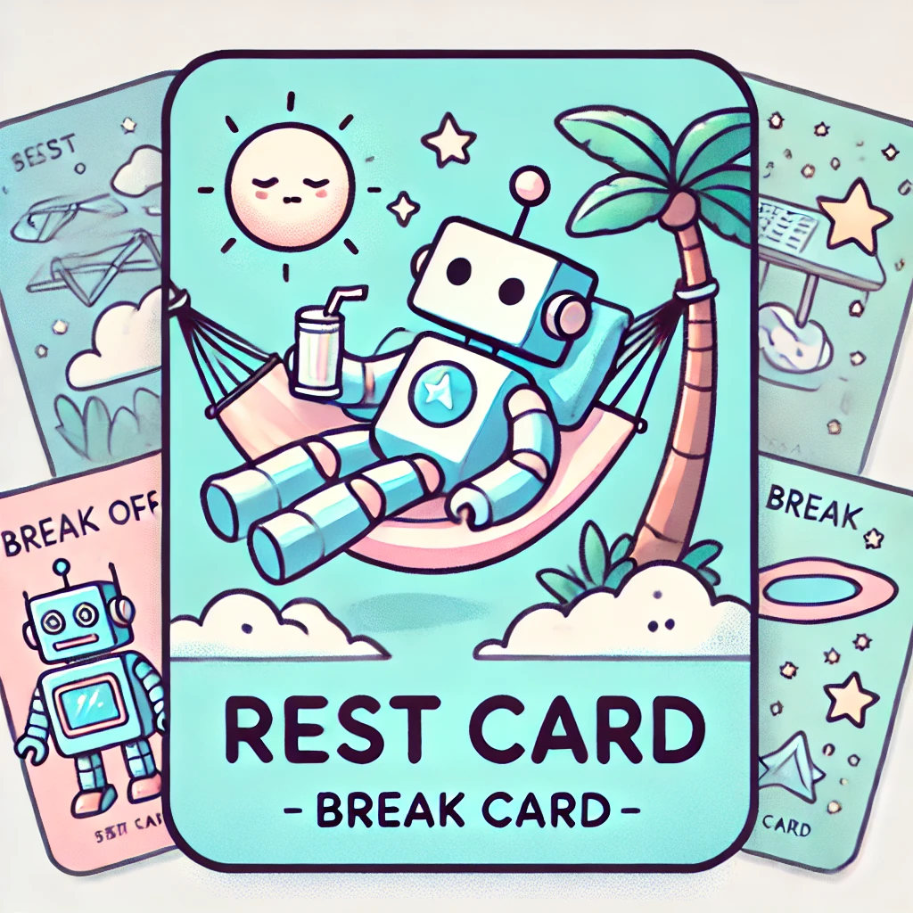

# Algorithm Challenge Repository

## 소개
알고리즘은 무엇일까요? 흔히들 문제해결능력은 소프트웨어 개발자들의 핵심 실력으로 여겨지곤 합니다. 
알고리즘은 현업에서 마주할 복잡한 문제해결을 위한 튼튼한 기초입니다. 알고리즘의 분야는 굉장히 방대합니다. 크게 나눠본다면 아래와 같습니다. 
| Category                 |
|--------------------------|
| Arrays & Hashing         |
| Two Pointers             |
| Sliding Window           |
| Stack                    |
| Binary Search            |
| Linked List              |
| Trees                    |
| Heap / Priority Queue    |
| Backtracking             |
| Tries                    |
| Graphs                   |
| Advanced Graphs          |
| 1-D Dynamic Programming  |
| 2-D Dynamic Programming  |
| Greedy                   |
| Intervals                |
| Math & Geometry          |
| Bit Manipulation         |

알고리즘은 문제해결 그 자체인 학문입니다. 처음에는 당연히 어려울 수 있습니다. 
요리를 하기 위한 어떠한 주방도구도 없기 때문입니다. 따라서 우리는 약 한달동안 100 문제를 품으로써 여러 주방도구를 갇기 위한 훈련을 시작할 것입니다. 
이 과정을 통해 멋진 요리를 만들게 될 것입니다. 
여러분이 알고리즘을 사랑하게 되고 현업에서도 꾸준히 알고리즘을 연습하길 바랍니다

## 규칙

1. **매일 3문제 풀기**: 매일 알고리즘 문제를 3개씩 풀고 업로드합니다.

2. **100문제 달성 목표**: 100문제를 달성하면 Level 1 AlgorithmRobot 배지를 얻을 수 있습니다.
3. **문제의 종류는 자유**: 어떤 알고리즘 문제든 상관없이 풀어도 됩니다.
4. **코드 업로드 및 PR 요청**: 매일 3개의 알고리즘 문제를 풀고, 자신의 코드를 push 한 후 pull request를 요청합니다. 해당 이슈와 링크시켜야 합니다 
5. **리뷰 필수**: 다른 사람들의 코드를 리뷰해야 합니다.
6. **벌칙** : 미션 실패시 밥을 삽니다. 참여자 전원에게 밥을 삽니다. 

6. **휴식 카드**: 모든 참여자는 5개의 휴식 카드를 가지고 있습니다. 이 카드를 사용하면 하루를 휴식할 수 있습니다. 그러나 5개의 카드를 모두 소진하면 처음부터 100문제를 다시 도전해야 합니다.

## 설명

알고리즘은 컴퓨터 과학의 핵심 요소로, 문제 해결 능력을 키우는 데 필수적입니다. 알고리즘을 통해 우리는 복잡한 문제를 효율적으로 해결하는 방법을 배우게 됩니다. 
알고리즘을 잘하는 사람 중 개발을 못하는 사람은 잘 본 적이 없습니다. 
알고리즘 문제를 해결하는 과정은 많은 사람들에게 큰 즐거움을 줍니다. 게임과 같습니다. 새로운 문제를 만나고, 그 문제를 해결하기 위한 최적의 방법을 찾아내는 과정은 매우 흥미롭고 만족스러운 경험이 됩니다. 특히, 문제를 해결한 후에는 성취감을 느낄 수 있습니다. 여러분이 꾸준히 푼 문제들은 나중에 더 어려운 문제를 위한 여러분들의 skill 이 될 것입니다. 체화하시기 바랍니다! 

이 repository는 여러분이 알고리즘 문제 해결 능력을 향상시키고, 함께 공부하며 성장할 수 있는 공간이 되기를 바랍니다. 매일의 도전을 통해 작은 성공을 쌓아가며, 더 큰 목표를 향해 나아가세요. 

함께 알고리즘의 세계로 떠나보아요!

## 참여 방법

1. 이 repository를 포크합니다.
2. 매일 알고리즘 문제를 3개 풀고 코드를 업로드합니다.
3. pull request를 요청합니다.
4. 다른 참여자들의 코드를 리뷰합니다.
5. 100문제를 달성하여 Level 1 AlgorithmRobot 배지를 획득합니다.

## FAQ

- **Q: 어떤 문제를 풀어야 하나요?**
  - A: 어떤 알고리즘 문제든 상관없습니다. 여러분이 풀고 싶은 문제를 선택하세요.
- **Q: 휴식 카드는 어떻게 사용하나요?**
  - A: 하루를 쉬고 싶을 때, 휴식 카드를 사용했다고 기록하면 됩니다. 5번까지 가능합니다.

## 연락처
문의사항이 있으면 언제든지 연락 주세요. 함께 성장하고 배워가는 즐거움을 나누길 바랍니다!

---

이 repository를 통해 모두가 알고리즘 실력을 향상시키고, 즐겁게 학습할 수 있기를 바랍니다. 화이팅!
